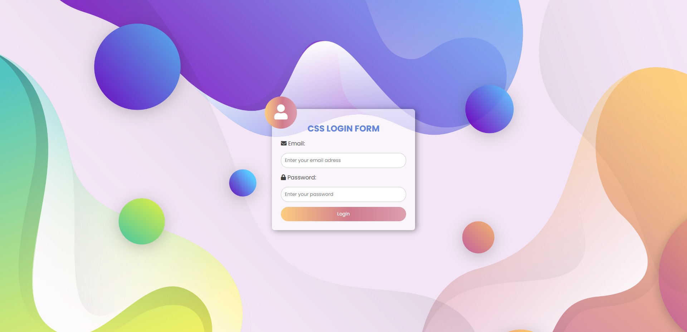

# Login UI using HTML, CSS, and JS

This project is a simple login UI using HTML, CSS, and JS.

## Usage

To run the project, open the index.html file in a web browser.

## Customization

You can customize the login UI by modifying the CSS styles in the styles.css file. Feel free to experiment with different colors, fonts, and layout arrangements.

## Requirements

* A web browser
* A basic understanding of HTML, CSS, and JavaScript

## Contributing

Contributions are welcome! If you find any issues or want to add new features, please open an issue or submit a pull request.

## Instructions

1. Clone the repository to your local machine.
2. Open the index.html file in a web browser.
3. The clock will start updating every second.

## Author

This project was created by Chirag P. Gauswami.

## License

This project is Open Source you can use it.

## Links

* [Source Code](https://github.com/chiragpgauswami/login-ui)
* [Demo](https://chiragpgauswami.github.io/login-ui)